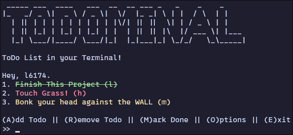

# Todominal
Minimal todo list for terminal and rofi.
> [!Note]
> This is my first project made using C++ and I am also very stupid when it comes to coding so the code is very messy and inefficient *(IT WORKS)*. Feel free to open a pull request for improvements.
## Preview
### Interactive CLI:

### Rofi:


## Dependencies
1. ```figlet```
2. ```gcc```
3. ```sed```

## Installation
### Arch Linux
```
$ git clone https://github.com/l6174/todominal.git
$ cd todominal
$ makepkg -si
```

### Build from Source
```
$ git clone https://github.com/l6174/todominal.git
$ cd todominal
$ g++ src/main.cpp -o bin/todominal
```
Then copy ```bin/todominal``` and ```bin/todominal_rofi``` to your ```$PATH```.

## Usage
### CLI
```
$ todominal help
Usage:
   todominal add {Task Name (string)} #To add Task
   todominal remove {Task Index (int)} #To remove Task
   todominal done {Task Index (int)} #To mark Task as done
   todominal clearall #To Delete ALL Tasks
   todominal list #To list Tasks
   todominal help #Print this Help dialog
Example:
   todominal remove 2
   todominal add "Hello World!"
   todominal done 3
```
### Rofi
Bind this command to any key preferred.
```
rofi -modi todo:todominal-rofi -show todo
```
To use a custom rofi theme
```
rofi -modi todo:todominal-rofi -show todo -theme <theme file location>
```
**Add Task**:

Enter your task name after a *hyphen* (```-```) in the rofi input field.

Example: ```- Example Task```

**Mark As Done**:

Select the task to mark as done then select "_Mark Done_".

**Remove Task**:

Select the task to remove then select "_Remove_".
> [!Note]
> Only for unix/linux based operating systems.
