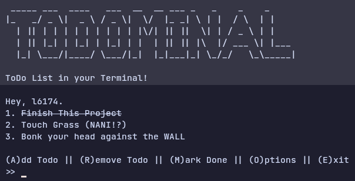

# Todominal
Minimal todo list for terminal.



## Dependencies
1. figlet
2. gcc

## Installation
### Arch Linux
```
$ git clone https://github.com/l6174/todominal.git
$ cd todominal
$ makepkg -si
```

## Build from Source
```
$ git clone https://github.com/l6174/todominal.git
$ cd todominal
$ g++ main.cpp -o todominal
```

> Note: Only works on unix/linux based operating systems.
